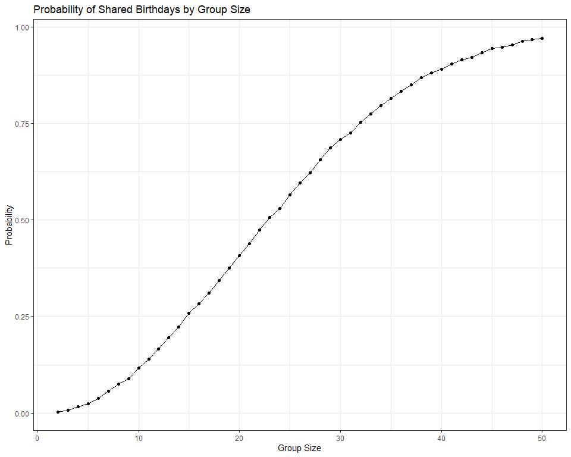
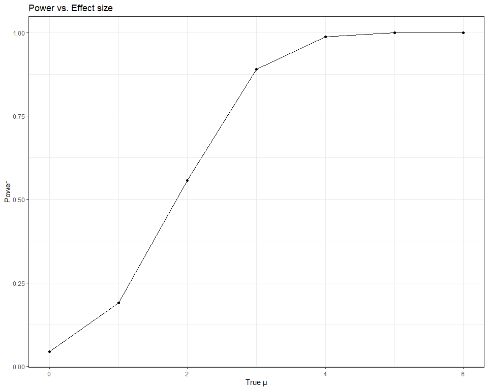
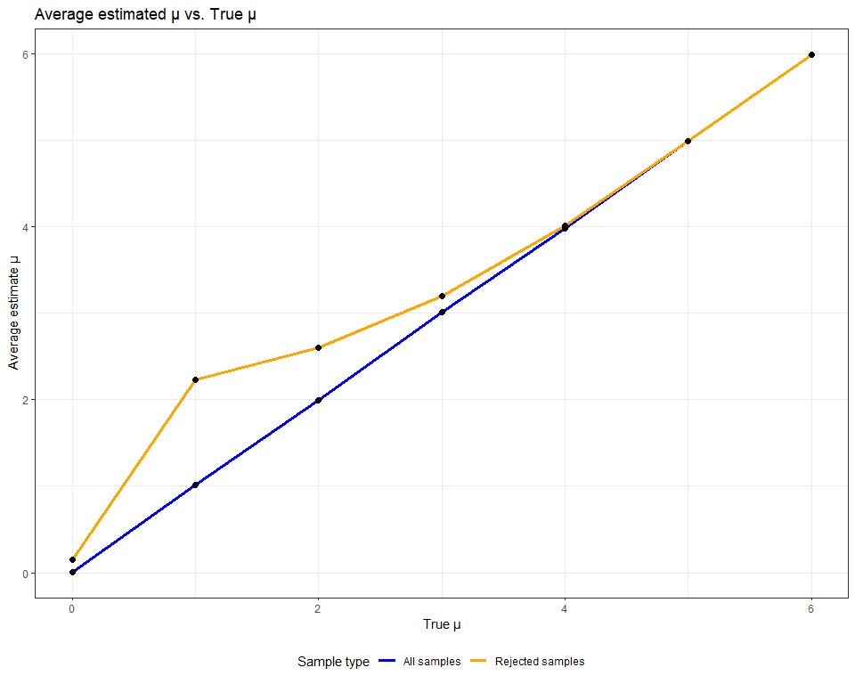
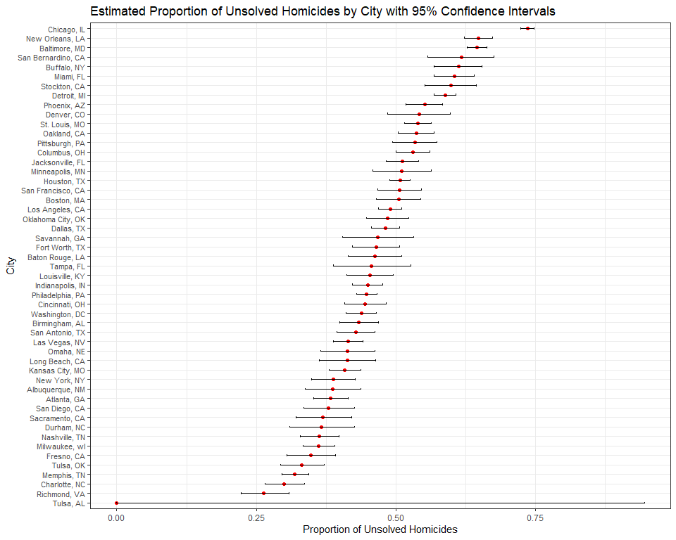

p8105_hw5_mb5357
================
Maria Beg
2025-11-12

## Problem 1

``` r
set.seed(123)

# Function 
birthday_sim = function(n) {
  birthdays = sample(1:365, size = n, replace = TRUE)
  any(duplicated(birthdays))
}


# Simulation + probability
prob_results = tibble(group_size = 2:50) |>
  mutate(prob_shared = map_dbl(group_size, 
                               ~ mean(replicate(10000, 
                               birthday_sim(.x)))))
```

``` r
# Plot the results
prob_results |>
  ggplot(aes(x = group_size, 
             y = prob_shared)) +
  geom_line() +
  geom_point() +
  labs(
    title = "Probability of Shared Birthdays by Group Size",
    x = "Group Size",
    y = "Probability"
  ) +
  theme_bw()
```

<!-- -->

The plot shows that as the group size increases, the likelihood of two
people sharing a birthday rises sharply. The probability reaches roughly
50% at a group size of about 23. By the time the group reaches around 50
people, the probability is very high, approaching 1. Overall, the
results illustrate how quickly these probabilities grow even with a
large number of possible birthdays.

## Problem 2

``` r
set.seed(123)

# Function to simulate data
sim_one = function(true_mu) {
  x = rnorm(30, mean = true_mu, sd = 5)
  t.test(x, mu = 0) |> 
    tidy() |> 
    select(estimate, p.value)
}


# Simulation
n_sims = 5000
true_means = 0:6

sim_results = map_df(true_means, function(mu) {
  replicate(n_sims,
            sim_one(mu),
            simplify = FALSE) |>
    bind_rows() |>
    mutate(true_mu = mu)
})


# Power Calculation
power_results = sim_results |> 
  group_by(true_mu) |> 
  summarize(power = mean(p.value < 0.05))
```

**Plot 1**

``` r
power_results |> 
  ggplot(aes(x=true_mu, y=power))+
  geom_line()+
  geom_point()+
  labs(
    title = "Power vs. Effect size",
    x = "True μ",
    y= "Power"
  )+
  theme_bw()
```

<!-- -->

The plot shows that the probability of rejecting the null hypothesis
(power) increases as the true mean μ grows. For small effect sizes (μ
near 0), power is low because the test rarely detects a difference.
Power rises rapidly for moderate effect sizes (μ ≈ 2–4) and approaches 1
for larger μ, illustrating that larger true effects are easier to detect
with a fixed sample size and variance.

**Plot 2**

``` r
# Average estimates

est_results = sim_results |> 
  group_by(true_mu) |> 
  summarize(
    avg_est = mean(estimate),
    avg_est_rejected = mean(estimate[p.value < 0.05])
  )


# Plot 2

est_results |> 
  ggplot(aes(x = true_mu)) +
  
  geom_line(aes(y = avg_est, 
                color = "All samples"), linewidth = 1.2) +
  geom_line(aes(y = avg_est_rejected, 
                color = "Rejected samples"), linewidth = 1.2) +
  
  geom_point(aes(y = avg_est), 
             color = "black", size = 2) +
  geom_point(aes(y = avg_est_rejected), 
             color = "black", size = 2) +
  
  scale_color_manual(values = c("All samples" = "blue", 
                                "Rejected samples" = "orange")) +
  
  labs(
    title = "Average estimated μ vs. True μ",
    x = "True μ",
    y = "Average estimate μ",
    color = "Sample type"
  ) +
  
  theme_bw() +
  theme(legend.position = "bottom")
```

<!-- -->

The average estimate of μ across all simulations closely matches the
true μ. When considering only samples where the null is rejected, the
estimate is biased upward, particularly for small true μ. This occurs
because rejection is more likely when a sample overestimates μ due to
random variation, a form of selection bias. As μ increases, more tests
reject the null, and the mean of rejected estimates approaches the true
μ.

## Problem 3

``` r
# Load dataset
homicide_df = 
  read_csv("https://raw.githubusercontent.com/washingtonpost/data-homicides/master/homicide-data.csv") |> 
  janitor::clean_names()
```

The dataset comprises 52,179 homicide cases from 50 U.S. cities, with
each row representing a single incident. It includes 12 variables: a
unique case identifier `uid`, the date the homicide was reported
`reported_date`, victim information `victim_first`, `victim_last`,
`victim_race`, `victim_age`, `victim_sex`, location `city`, `state`,
`lat`, `lon`, and case status `disposition`. For example, one row
records a homicide in Baltimore, MD, on January 1, 2007, where the
victim, a 17-year-old Black male named Leon Nelson, has an open case
with no arrest, and the location is recorded by latitude and longitude
coordinates.

``` r
# Create city_state variable and summarize
homicide_summary = homicide_df |>
  mutate(
    city_state = str_c(city, ", ", state),
    unsolved = disposition %in% c("Closed without arrest", 
                                  "Open/No arrest")
  )  |>
  group_by(city_state) |>
  summarize(
    total = n(),
    unsolved = sum(unsolved),
  )


# Baltimore prop.test
baltimore_test = homicide_summary |>
  filter(city_state == "Baltimore, MD") |>
  summarize(
    test = list(prop.test(unsolved, total))
  ) |>
  mutate(tidy_test = map(test, tidy)) |>
  unnest(tidy_test) |>
  select(estimate, conf.low, conf.high)
```

About 64.6% of homicides in Baltimore, MD are unsolved, with a 95%
confidence interval from 62.8% to 66.3%.

``` r
# prop.test for all cities
city_test = homicide_summary |>
  mutate(
    test = map2(unsolved, total, ~ prop.test(.x, .y)),
    tidy_test = map(test, tidy)
  ) |>
  unnest(tidy_test) |>
  select(city_state, total, unsolved, estimate, conf.low, conf.high)
```

``` r
# Plot proportion of unsolved homicides

city_test |>
  mutate(city_state = fct_reorder(city_state, 
                                  estimate)) |>
  ggplot(aes(x = city_state, 
             y = estimate)) +
  geom_point(color = "red") +
  geom_errorbar(aes(ymin = conf.low, 
                    ymax = conf.high), 
                width = 0.2) +
  labs(
    title = "Proportion of Unsolved Homicides by City",
    x = "City",
    y = "Proportion of Unsolved Homicides"
  )  +
  coord_flip() +
  theme_bw() +
  theme(axis.text.y = element_text(size = 8))
```

<!-- -->

The plot shows that the proportion of unsolved homicides varies
substantially across cities. For example, Richmond, VA has a relatively
low proportion of unsolved cases, while Chicago, IL has a much higher
proportion. Most cities fall roughly in the 40%–60% range.

The error bars represent 95% confidence intervals for each city’s
unsolved proportion, reflecting uncertainty due to sample size. Tulsa,
AL stands out as an outlier with an extremely wide confidence interval,
nearly spanning 0 to 1, because the city has only one homicide case in
the dataset. This illustrates that estimates based on very small sample
sizes are highly uncertain.
