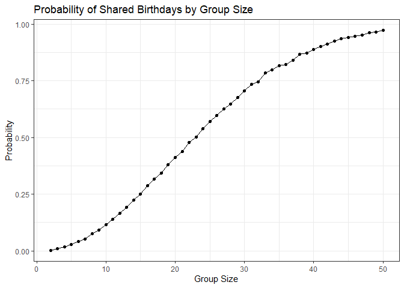

p8105_hw5_mb5357
================
Maria Beg
2025-11-12

## Problem 1

``` r
set.seed(1)

# Function 

birthday_sim <- function(n) {
  birthdays <- sample(1:365, size = n, replace = TRUE)
  any(duplicated(birthdays))
}


# Run 10,000 simulations 

sim_results <- 
  expand_grid(
    group_size = 2:50,
    iter = 1:10000
  ) |>
  mutate(shared = map_lgl(group_size, birthday_sim))


# Compute probability of at least one shared birthday

prob_results <- 
  sim_results |>
  group_by(group_size) |>
  summarize(prob_shared = mean(shared))


# Plot the results
prob_results |>
  ggplot(aes(x = group_size, 
             y = prob_shared)) +
  geom_line() +
  geom_point() +
  labs(
    title = "Probability of Shared Birthdays by Group Size",
    x = "Group Size",
    y = "Probability"
  ) +
  theme_bw()
```

<!-- -->

The plot shows that as the group size increases, the likelihood of two
people sharing a birthday rises sharply. The probability reaches roughly
50% at a group size of about 23. By the time the group reaches around 50
people, the probability is very high, approaching 1. Overall, the
results illustrate how quickly these probabilities grow even with a
large number of possible birthdays.
